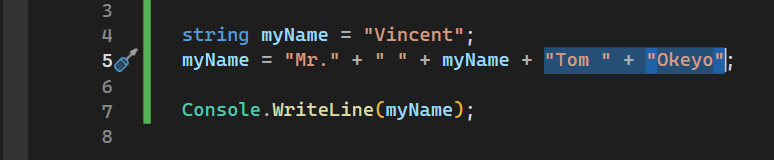
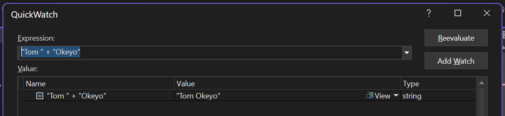
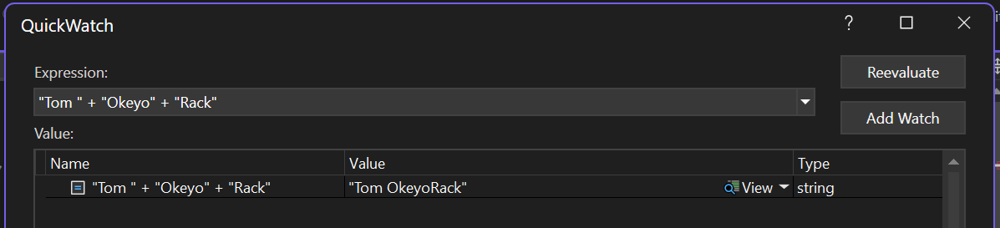

# Learning objectives
1. How to use <b>breakpoints</b> to <b>debug</b> 
code.
2. What <b>QuickWatch</b> window is and how to 
use it.

## Long way to debug
- Write/log something to a text file, or
- Print something on the screen using, for 
example, `Console.WriteLine()`.
- This allows you to track the value of a variable 
as the code executes.
- Example:

```
string myName = "Vincent";
myName = myName + " " + "Tom";

Console.WriteLine(myName);	// Shows you the value of myName after executing some code.
```

- However, you have to remember to remove the 
debugging code after you are done with it.

## A better way to debug
- Use breakpoints on lines of code.
- There are two ways to insert breakpoints in code:
1. Click on the panel on the left hand side.
2. Click anywhere on the line of code and press 
`F9`. Pressing `F9` again with the cursor on the 
line of code removes the breakpoint.
- The breapoint stops code execution right before 
the line of code on which the breakpoint is gets 
executed.
- Allows to to step over the line of code and get 
it executed, after which execution again stops.
- In this way, you get the opportunity to examine 
the values of variables processed up to the 
breakpoint.
- To step over a line of code, press `F10` or click 
on the <b> step over button</b> on the toolbar.
- Hovering over the variable of interest shows 
you its current value.
- When done with debugging, you can allow the 
program to continue executing to the end or until 
another breakpoint is reached by pressing the 
<b>Continue</b> button on the toolbar.

Debugging with breakpoints allows us to 
troubleshoot errors in code without cluttering 
code with lines the write values to text files 
or print messages to the console. It also allows 
us to inspect values of more complex objects whose 
values would not be easily readable if printed to 
the console or to file.

## QuickWatch window
- Select the code part of interest.<br>



- Press `Shift + F9` to open the <b>QuickWatch</b> window.<br> 



- Change the expression and click <b>Reevaluate</b> 
to view the results.<br>



