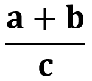

# Coding excercise - Variables and operators
Study the code below and update it to satisfy the 
following requirement:<br>

To the variable `result` below, assign the result 
of the following operation<br>



## Code
```csharp
using System;

namespace Coding.Exercise1
{
	public class Excercise
	{
		public static int VariablesAndOperators()
		{
			var a = 5;
			var b = 10;
			var c = 3;

			int result = 5;	// Your code goes here

			return result;
		}
	}
}
```